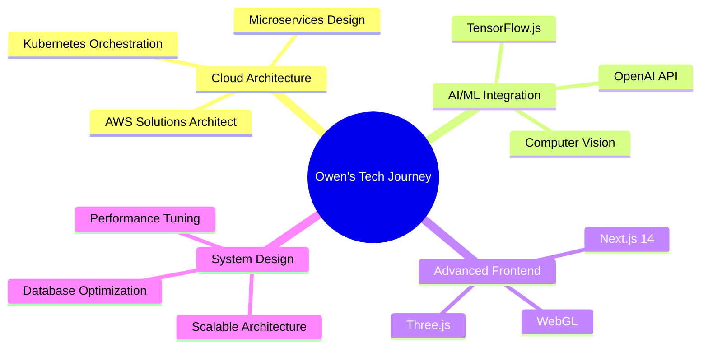

# <div align="center">✨ Hello, I'm Owen ✨</div>

<div align="center">
  
</div>

### <div align="center">🎯 *Transforming Ideas into Elegant Code | Passionate Full Stack Developer* 🎯</div>

<div align="center">
  
</div>

<div align="center">
  <a href="https://sathanakon.site/" target="_blank">
    
  </a>
  <a href="https://www.linkedin.com/in/sathanakon-bunphim-34930a256/" target="_blank">
    
  </a>
  <a href="http://www.instagram.com/str_owen/" target="_blank">
    
  </a>
  <a href="https://www.youtube.com/@source_owen7518" target="_blank">
    
  </a>
  <a href="mailto:satanakornbunpim@gmail.com">
    
  </a>
</div>

<div align="center">
  
</div>

---

## 🌟 About Me


```typescript
interface Developer {
  name: string;
  nickname: string;
  role: string;
  education: {
    university: string;
    year: number;
    major: string;
  };
  location: string;
  currentFocus: string[];
  philosophy: string;
  achievements: string[];
  personality: {
    traits: string[];
    interests: string[];
    motto: string;
  };
}

const owen: Developer = {
  name: "Sathanakon Bunphim",
  nickname: "Owen",
  role: "Full Stack Developer & Tech Enthusiast",
  education: {
    university: "King Mongkut's University of Technology Thonburi",
    year: 3,
    major: "Computer Engineering"
  },
  location: "Bangkok, Thailand 🇹🇭",
  currentFocus: [
    "Advanced DevOps & Cloud Architecture",
    "Microservices & System Design",
    "AI/ML Integration in Web Apps",
    "Open Source Contributions"
  ],
  philosophy: "Great software isn't just built with code, it's crafted with purpose and passion.",
  achievements: [
    "Top 15 at Makathon Next Gen 🏆",
    "Built 20+ full-stack applications",
    "Mentored 10+ junior developers"
  ],
  personality: {
    traits: ["Problem Solver", "Creative Thinker", "Team Player", "Lifelong Learner"],
    interests: ["Tech for Social Good", "UI/UX Psychology", "Automation", "Gaming"],
    motto: "Code with purpose, design with heart, build with passion"
  }
};
```

---

## 🚀 Tech Arsenal

<div align="center">

### 💻 Core Languages


### 🎨 Frontend Magic


### 🔧 Backend Power


### 🗄️ Database & Storage


### ☁️ Cloud & DevOps


### 🎯 Tools & Workflow


</div>

---

## 📊 GitHub Analytics Dashboard

<div align="center">
  
</div>

<div align="center">
  
  
</div>

<div align="center">
  
</div>

<div align="center">
  
</div>

---

## 🏆 Achievement Gallery

<div align="center">
  
</div>

---

## 🎯 Featured Projects

<div align="center">

| Project | Description | Tech Stack | Status |
|---------|-------------|------------|--------|
| 🧠 **Scan for Parent Game** | STEM EdTech game bridging students & parents | React + Node.js + MongoDB | ✅ Live |
| 🛒 **Phone Case Shop** | Full-stack e-commerce with admin panel | Django + MySQL + Bootstrap | ✅ Live |
| 📚 **Library Management System** | Complete library automation solution | Flask + SQLAlchemy + Vue.js | ✅ Live |
| 📊 **Budget Tracker WebApp** | Personal finance dashboard with analytics | React + Express + PostgreSQL | ✅ Live |
| 🤖 **AI Chat Assistant** | Intelligent chatbot with NLP capabilities | Python + FastAPI + OpenAI | 🚧 In Progress |
| 🌐 **DevOps Pipeline** | CI/CD automation for web applications | Docker + K8s + GitHub Actions | 🚧 In Progress |

</div>

---

## 📈 Coding Activity

<!--START_SECTION:waka-->
```text
TypeScript   8 hrs 45 mins   ████████████░░░░░░░░░░░░░   48.23%
Python       4 hrs 32 mins   ██████░░░░░░░░░░░░░░░░░░░   25.01%
JavaScript   2 hrs 15 mins   ███░░░░░░░░░░░░░░░░░░░░░░   12.45%
React        1 hr 48 mins    ██░░░░░░░░░░░░░░░░░░░░░░░   09.95%
CSS          45 mins         █░░░░░░░░░░░░░░░░░░░░░░░░   04.36%
```
<!--END_SECTION:waka-->

---

## 💡 Current Learning Journey

<div align="center">



</div>

---

## 🌐 Connect & Collaborate

<div align="center">
  
### 💬 Let's build something amazing together!

<table>
<tr>
<td align="center">
<br />
<sub><b>Ready to collaborate on:</b></sub><br />
• Full-stack web applications<br />
• Open source projects<br />
• Tech mentoring & knowledge sharing<br />
• Innovative startup ideas<br />
</td>
</tr>
</table>

[](https://github.com/satanakorn)
[](https://github.com/satanakorn)

</div>

---

## 🎨 Fun Facts & Interests

<div align="center">

| 🎮 Gaming | 🎵 Music | 📚 Learning | 🌟 Goals |
|-----------|----------|-------------|----------|
| Strategy & RPG Games | Lo-fi & Electronic | System Design | Build impactful products |
| Competitive Programming | Music Production | Cloud Architecture | Contribute to open source |
| Game Development | Concert Photography | AI/ML Applications | Mentor aspiring developers |

</div>

---

<div align="center">
  
</div>

<div align="center">
  
</div>

<!-- Snake eating contribution graph -->
<div align="center">
  
</div>
